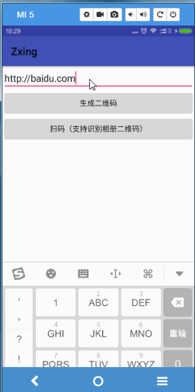
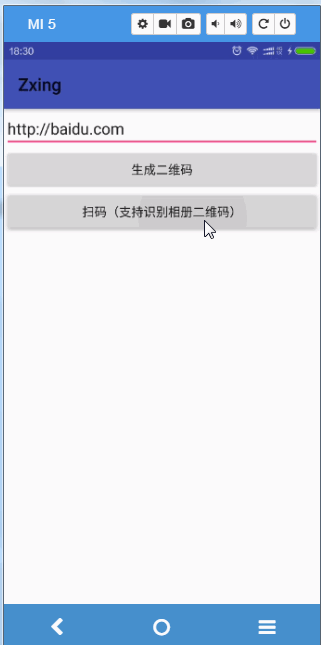
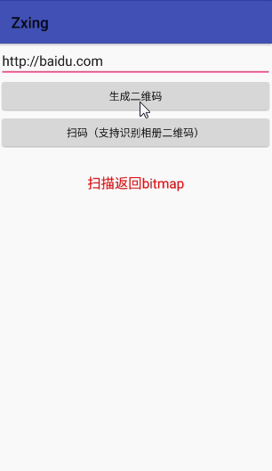

# 谷歌二维码引擎zxing的使用
---
开源地址：[https://github.com/open-android/Zxing](https://github.com/open-android/Zxing "https://github.com/open-android/Zxing")

# 运行效果

* 爱生活,爱学习,更爱做代码的搬运工,分类查找更方便请下载黑马助手app

## 使用步骤

### 1. 在project的build.gradle添加如下代码(如下图)

	allprojects {
	    repositories {
	        maven { url "https://jitpack.io" }
	    }
	}

### 2. 在Module的build.gradle添加依赖

    compile 'com.github.open-android:Zxing:v1.0.3'

### 3.清单文件添加权限

	<uses-permission android:name="android.permission.CAMERA" />
	<uses-permission android:name="android.permission.WRITE_EXTERNAL_STORAGE" />
	<uses-feature android:name="android.hardware.camera" />
	<uses-feature android:name="android.hardware.camera.autofocus" />
	<uses-permission android:name="android.permission.VIBRATE" />
	<uses-permission android:name="android.permission.FLASHLIGHT" />

### 4.调用扫描和生成二维码功能

#### 4.1打开CaptureActivity扫描
	
    startActivity(new Intent(MainActivity.this, CaptureActivity.class));

#### 4.2传入内容生成二维码

	String content = mEt.getText().toString().trim();
    Bitmap bitmap = null;
    try {
        bitmap = BitmapUtils.create2DCode(content);
        mImage.setImageBitmap(bitmap);
    } catch (WriterException e) {
        e.printStackTrace();
    }

	
* 详细的使用方法在DEMO里面都演示啦,如果你觉得这个库还不错,请赏我一颗star吧~~~

* 欢迎关注微信公众号

	
